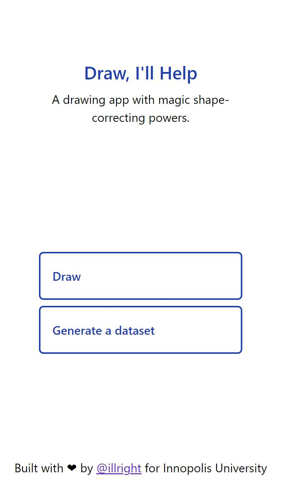
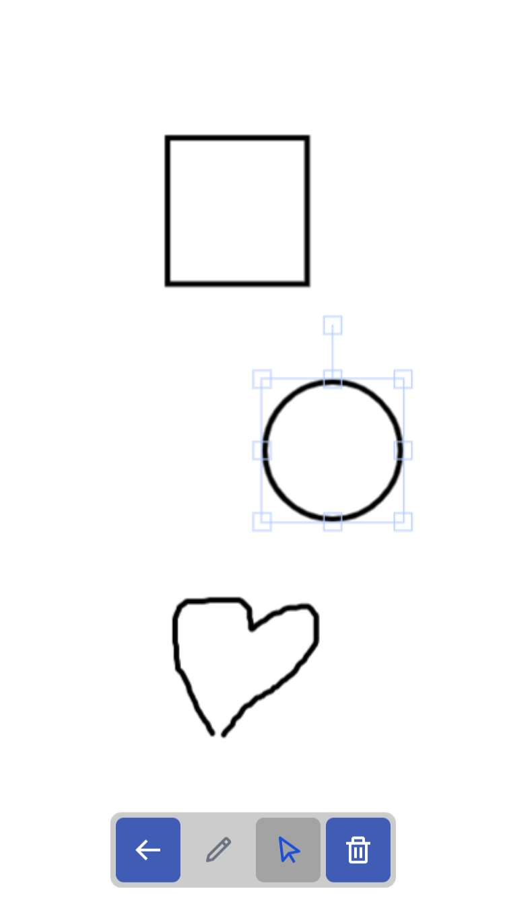

# Draw, I'll Help

A progressive web application for drawing that automatically corrects hand-drawn circles and rectangles with the power of YOLOv5.

Check it out at <https://illright.github.io/draw-ill-help>.

## Highlights

* 🏎️ Completely serverless
* 🌐 Works offline
* 🧠 Runs YOLOv5 Nano in the background
* 🗃️ Built-in dataset generator
* 😎 Automatic dark mode
* 🍰 Follows the [feature-sliced methodology](https://feature-sliced.design/)

## Screenshots

<table>
<thead>
<th>Home page</th>
<th>Drawing canvas</th>
<th>Dataset generator</th>
</thead>
<tr>
<td>



</td>
<td>



</td>
<td>


</td>
</tr>
</table>

## Running locally

Grab the `model.zip` file from the latest release and unpack its contents into `static/`. Then run the usual commands:

```bash
pnpm i
pnpm dev
```

## Training YOLOv5 yourself

The notebook with explanations for the training process is available in the [`yolov5/`](./yolov5) directory.

The recommended way to run the notebook is with Google Colaboratory. If you're using the GPU session and the free Colab account, the dataset of around 1.5k 416x416 images should take around two hours to train.

[](https://colab.research.google.com/github/illright/draw-ill-help/blob/main/yolov5/training.ipynb)

## License

The source code of this project is distributed under the terms of the MIT license. [Click here](https://choosealicense.com/licenses/mit/) to learn what that means.
