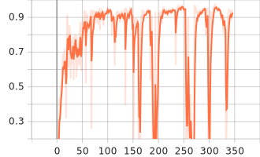
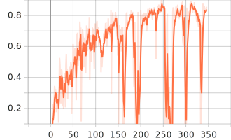
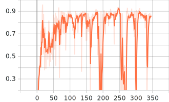
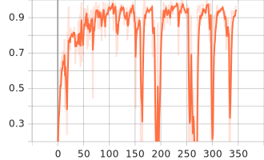

# Draw, I'll Help

A progressive web application for drawing that automatically corrects hand-drawn circles and rectangles with the power of YOLOv5.

Check it out at <https://illright.github.io/draw-ill-help>.

## Highlights

- 🏎️ Completely serverless
- 🌐 Works offline
- 🧠 Runs YOLOv5 Nano in the background
- 🗃️ Built-in dataset generator
- 😎 Automatic dark mode
- 🍰 Follows the principles of [Feature-Sliced Design](https://feature-sliced.design/)

## Screenshots

<table>
<thead>
<th>Home page</th>
<th>Drawing canvas</th>
<th>Dataset generator</th>
</thead>
<tr>
<td>


</td>
<td>


</td>
<td>


</td>
</tr>
</table>

## Model performance

Since the selected model is the smallest in the family of YOLOv5, it has very small inference times and file size. However, that also has an impact on its predictive capabilities.

See the charts below for the main performance characteristics of the model during training. The model had trained for around 350 epochs, early stopping with a patience value of 100 epochs due to no improvement at the target metric (0.9 of **mAP (0.5:0.95)** and 0.1 of **mAP (0.5)**). The horizontal axis represents the epochs (aka steps).

<table>
<thead>
<th>mAP (0.5)</th>
<th>mAP (0.5:0.95)</th>
<th>Precision</th>
<th>Recall</th>
</thead>
<tr>
<td>

<picture>
  <source srcset="./.github/readme/metrics_mAP_0.5.svg" media="(prefers-color-scheme: dark)" />
  
</picture>

</td>
<td>

<picture>
  <source srcset="./.github/readme/metrics_mAP_0.5_0.95.svg" media="(prefers-color-scheme: dark)" />
  
</picture>

</td>
<td>

<picture>
  <source srcset="./.github/readme/metrics_precision.svg" media="(prefers-color-scheme: dark)" />
  
</picture>

</td>
<td>

<picture>
  <source srcset="./.github/readme/metrics_recall.svg" media="(prefers-color-scheme: dark)" />
  
</picture>

</td>
</tr>
</table>

## Running locally

Grab the `model.zip` file from the latest release and unpack its contents into `static/`. Then run the usual commands:

```bash
pnpm i
pnpm dev
```

## Training YOLOv5 yourself

The Jupyter notebook with explanations for the training process is available in the [`yolov5/`](./yolov5) directory.

The recommended way to run the notebook is with Google Colaboratory. If you're using the GPU session and the free Colab account, the dataset of around 1.5k 416x416 images should take around two hours to train.

[](https://colab.research.google.com/github/illright/draw-ill-help/blob/main/yolov5/training.ipynb)

## License

The source code of this project is distributed under the terms of the MIT license. [Click here](https://choosealicense.com/licenses/mit/) to learn what that means.
